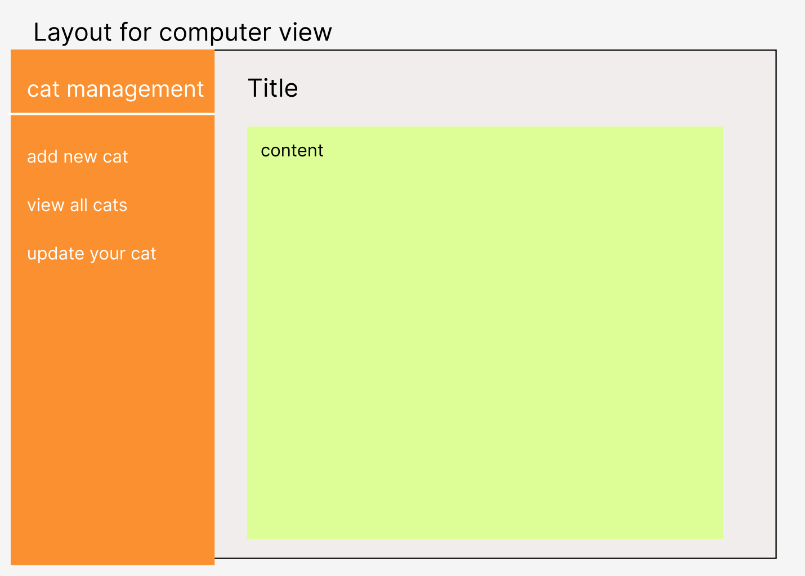
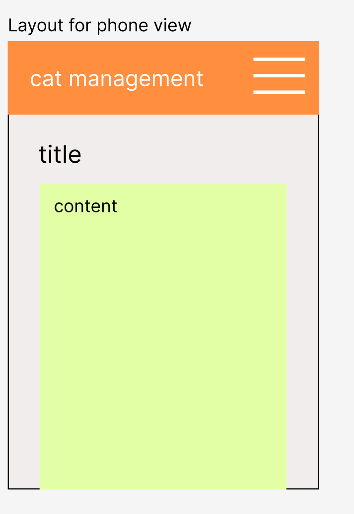
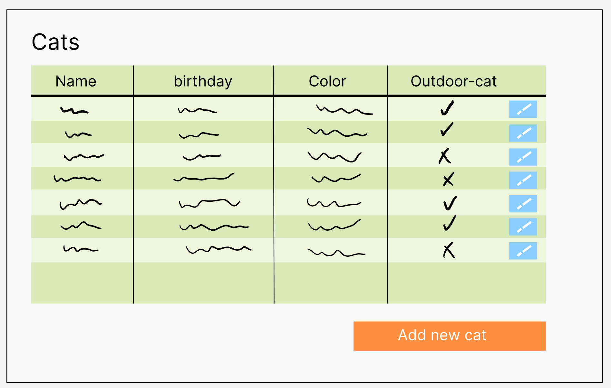
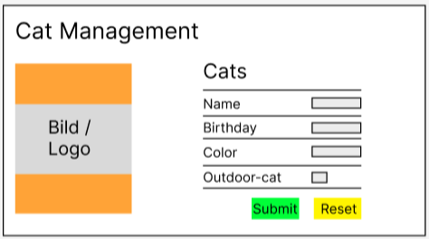
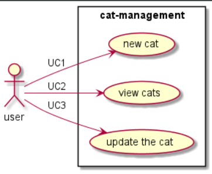

# cat-management

## ✏️ Projektbeschreibung

Ein Katzenverwaltungstool, wo man seine Katzen verwalten kann. Man kann über ein Form neue Katzen hinzufügen und 
die eingegebenen Daten werden auch validiert. 
Die Katzen können dann angeschaut werden. Es werden keine Bilder, sondern nur Textinformationen über die Katzen hochgeladen.
Die Website wird dann auf Deutsch und Englisch verfügbar sein.

## 📒 Layout

In diesem Kapitel sind alle Layouts zu finden, die in diesem Projekt verwendet werden.
Mit Hilfe von den Bootstrap Templates sind wir auf die folgenden Lösungen gekommen.

### Layout für Computer / IPad:

In diesem Layout wird der Content ersetzt wie zum Beispiel mit einer Tabelle, die alle Katzen ausgibt. Auf der linken
Seite ist die Navigation und sobald der User auf einen der Themen klickt, wird der Content mit dem jeweiligen Thema
ersetzt. Der Titel der Seite kann zum Beispiel sein `Neue Katze erfassen`.

### Layout für Phone:

Auch in diesem Layout wird der Content ersetzt mit dem jeweiligen Thema. Oben ist ein Header sowie auch ein
Hamburger-Menü. In diesem Hamburger-Menü sind auch die gleichen Links zu finden wie im Layout für Computer. Der Titel
dieser Seite kann auch hier zum Beispiel `Neue Katze erfassen` sein.

## 🖼️ GUI Skizzen

### View all Cats

Hier ist ein Wireframe für die Anzeige aller Katzen. Die Daten werden in einer Tabelle angezeigt und mit der
Schaltfläche `add new cat` wird ein neues Fenster geöffnet. Mit dem blauen Button kann die Katze bearbeitet werden, z.B.
den Geburtstag ändern.

### Create a Cat

Dieses Wireframe zeigt die Seite auf der, der User eine Katze erstellen kann. Auf der Seite ist unser Bild/Logo in der
`Sidebar`. Daneben auf der rechten Seite ist das Formular um die Daten der neuen Katze einzutragen. Und unterhalb kann
der User die Daten wieder löschen, indem er auf den `Reset`-Button klickt. Und beim `Submit`-Button wird die Katze mit
den eingegebenen Daten erstellt. Falls ein Input-Feld nicht mit unserem Fehler-Handling übereinstimmt, wird auf der
rechten Seite den entsprechender Error angezeigt.

### Update Cat

Und das letzte Wireframe ist dafür da um die ausgewählte Katze zu bearbeiten. Auf der Seite ist wieder unser Bild/Logo
in der `Sidebar`. Auf der rechten Seite der Webseite ist das Formular in den der User die Daten geben kann. Ein
wichtiger Punkt ist das der User den Namen der Katze nicht ändern darf. Bei der `Checkbox` wird es ausgewählt sein wenn
es eine `outdoor-cat`ist. Zum Schluss um es abzuspeichern und zu beenden, kann der User den `update`-Button anklicken.

## 🎬 Use Cases

Unter diesem Kapitel stehen die Use Cases. Wir haben uns für diese drei Use Cases entschieden, im unterem UML Diagramm
sind sie ersichtlich.

Der erste Use Case ist, wenn unser User eine neue Katze in unser `cat-management` (System) eintragen möchte. Das zweite
ist dafür da, die Katzen in unserem `cat-management` anzuschauen. Und das dritte sowie auch das letzte kann der User die
eingegebenen Katzen bearbeiten, wenn die Daten nicht mehr aktuell wären.
